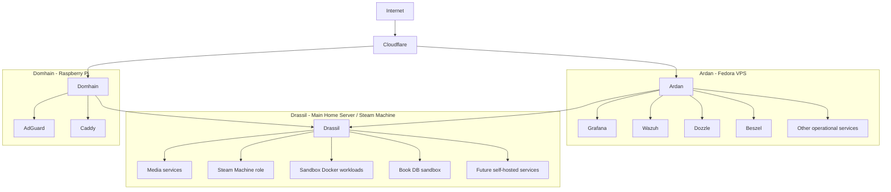

# 👋 Hello, I'm Alex

IAM Engineer focused on **Identity, Security Engineering, and Infrastructure Automation**.

I enjoy building systems that are **secure, observable, and reproducible** using tools like Terraform, Linux, and modern cloud platforms.

Outside of work I build **homelab infrastructure, SIEM systems, and developer tools** to explore security, monitoring, and automation.

---

# 🔐 Areas of Focus

- Identity & Access Management
- Security Engineering
- Detection Engineering / SIEM
- Infrastructure as Code
- Homelab Automation
- Backend Development (Go)

---

# 🧰 Technology Stack

### Languages

### Infrastructure

### IAM & Security

### Observability

---

# 🚀 Featured Projects

### 📚 Chronicle
Go CLI tool that collects **book metadata via ISBN** and stores it in a database used for **Grafana dashboards and reading analytics**.

Features:

- ISBN normalization
- Metadata ingestion
- PostgreSQL storage
- Grafana visualization

---

### 🔍 SIEM Project

Personal **Wazuh-based SIEM lab** used to explore:

- detection engineering
- log ingestion
- security monitoring
- alert pipelines

---

### 🧠 Terraform Homelab

Infrastructure-as-Code driven homelab including:

- monitoring stack
- DNS infrastructure
- SIEM deployment
- media services
- automation pipelines

All infrastructure is **fully reproducible using Terraform**.

---

# 🖥 Homelab Architecture

---

# 📈 Security & Monitoring Stack

My monitoring and detection pipeline includes:

| Component | Purpose |
|--------|--------|
| Wazuh | SIEM / Threat Detection |
| Grafana | Observability dashboards |
| Prometheus | Metrics collection |
| Loki | Log aggregation |
| Terraform | Infrastructure provisioning |
| Docker | Service orchestration |

---

# 📊 Development Activity

---

# ⚡ Coding Activity

---

# 🌱 Currently Learning

- Go development for CLI tools
- Detection engineering
- Security architecture
- Advanced Terraform workflows

---

# 🐍 Contribution Graph

  

---

# 📫 Connect With Me

GitHub:  
https://github.com/anubis619
